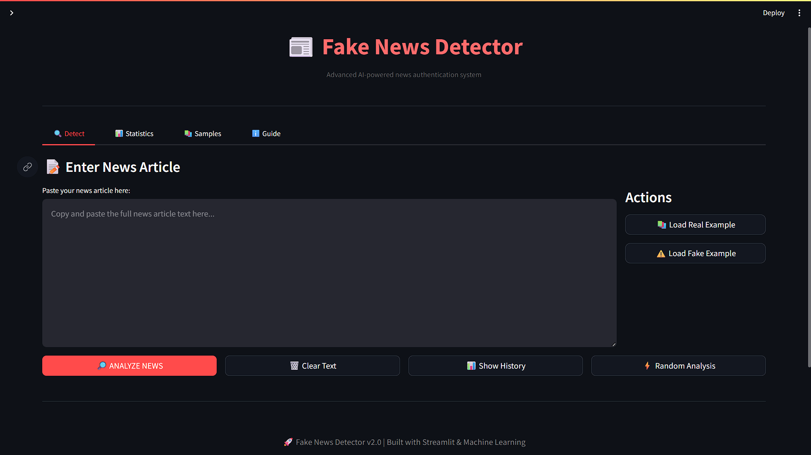
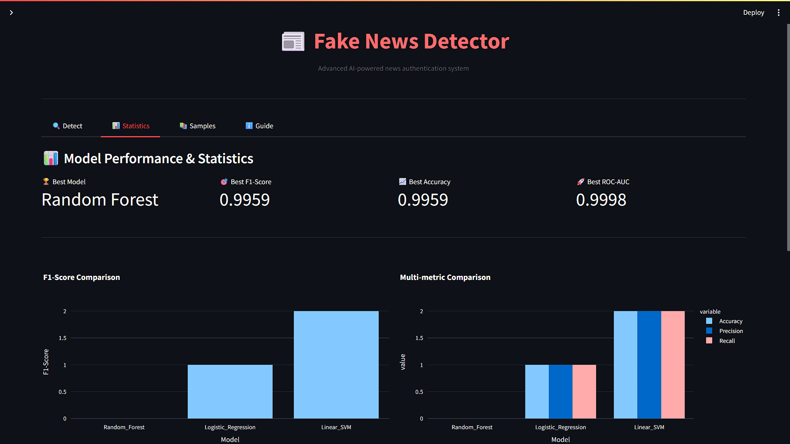

# 🔍 Fake News Detection System

AI‑powered news authentication system that classifies news articles as **Real** or **Fake** using TF‑IDF features and multiple machine learning models (Random Forest, Logistic Regression, Linear SVM), exposed through an interactive Streamlit app.

> 🔴 Live demo: **[Try it here →](https://its-adarsh2003-fake-news-detection.streamlit.app)**




---

## ✨ Key Features

- ✅ Real‑time fake news detection with confidence score  
- ✅  High test accuracy (~99.6%) on the used dataset (Random Forest baseline)
- ✅ TF‑IDF feature extraction (5000 features, unigrams + bigrams, English stopwords)  
- ✅ Comparison of multiple models: Random Forest, Logistic Regression, Linear SVM (calibrated)
- ✅ Clean Streamlit UI with statistics, samples, and an educational guide tab  

---

## 📊 Model Performance (example)

| Model               | Accuracy | Precision | Recall | F1‑Score | ROC‑AUC |
|---------------------|---------:|----------:|-------:|---------:|--------:|
| Random_Forest       | 0.9959   | 0.9959    | 0.9959 | 0.9959   | 0.9998  |
| Logistic_Regression | 0.99xx   | 0.99xx    | 0.99xx | 0.99xx   | 0.99xx  |
| Linear_SVM          | 0.99xx   | 0.99xx    | 0.99xx | 0.99xx   | 0.99xx  |

Exact values are stored in `results/model_results.json` and visualized in the **Statistics** tab of the app.

---

## 🧠 How It Works

1. **Input** → User pastes a news article into the Detect tab.  
2. **Preprocessing** → Text is cleaned: lowercased, URLs and punctuation removed, stopwords removed, stemming applied.
3. **Feature Extraction** → Cleaned text is converted to TF‑IDF vectors (max_features=5000, ngram_range=(1, 2)).  
4. **Model Training** → Random Forest, Logistic Regression, and Linear SVM (with `CalibratedClassifierCV` for probabilities) are trained and evaluated.
5. **Model Selection** → Best model by weighted F1‑score is saved as `models/best_model.pkl`.  
6. **Inference** → Streamlit app loads the best model + TF‑IDF vectorizer, predicts Real/Fake, and shows confidence + clickbait heuristics.

---

## 📚 Dataset

- **Total samples:** ~44,898 news articles  
- **Labels:** Real (1) and Fake (0), roughly balanced  
- **Source:** Kaggle Fake News / Fake vs True News dataset (linked in `data/README.md`).  

Dataset CSVs (`Fake.csv`, `True.csv`) are not committed to Git; download them manually and place as:

```Text
data/News_dataset/Fake.csv
data/News_dataset/True.csv

---

## 🛠 Tech Stack
- **Language:** Python 3.10+  
- **ML / NLP:** scikit-learn, TF-IDF, RandomForestClassifier, LogisticRegression, LinearSVC  
- **App:** Streamlit, Plotly  
- **Data:** Pandas, NumPy, NLTK  

---

## 💻 Setup & Usage

> 💡 **Tip:** Make sure to download the dataset first and place files under `data/News_dataset/`.

### Clone Repository
```bash
git clone https://github.com/its-Adarsh2003/fake-news-detection.git
cd fake-news-detection

# Create and activate virtual environment (Windows)
python -m venv venv
venv\Scripts\activate

# Install dependencies
pip install -r requirements.txt
> 💡 Tip: Always activate your virtual environment before installing dependencies.

Download the dataset from Kaggle and place the files under data/News_dataset/ as shown above.

1️⃣ Train models
bash
python train_pipeline.py
This will:

Train Random Forest, Logistic Regression and Linear SVM.

Select the best model by F1‑score and save it to models/best_model.pkl.

Save all model metrics to results/model_results.json.

(Optional) quick test:

bash
python test_model.py
2️⃣ Run Streamlit app
bash
streamlit run app.py
Use the tabs to:

Detect fake/real news with confidence.

View model comparison charts.

Test with sample articles.

Read the guide on fake news and verification.

⚠️ Disclaimer
This project is for educational and research purposes only.
Predictions may be incorrect; always verify critical news with multiple trusted sources.

## 🚀 Future Improvements
- Integrate transformer-based models (BERT / RoBERTa)
- Add multilingual fake news detection
- Improve explainability with SHAP / LIME
- Deploy backend with FastAPI for scalability


