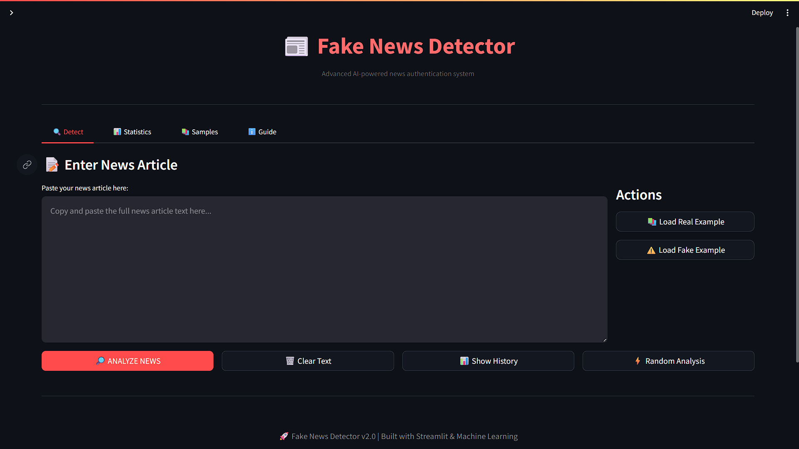
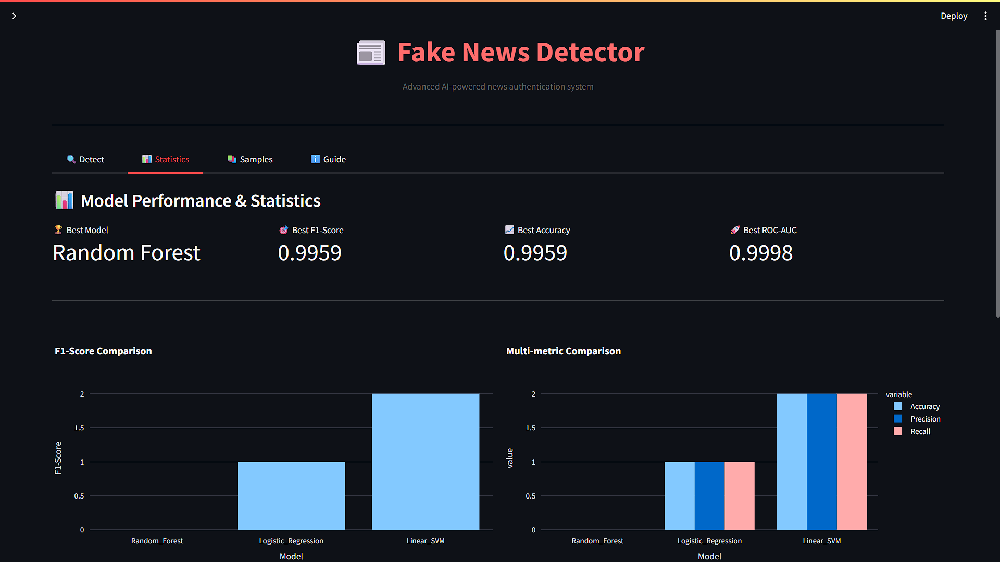

# 🔍 Fake News Detection System

AI‑powered news authentication system that classifies news articles as **Real** or **Fake** using TF‑IDF features and multiple machine learning models (Random Forest, Logistic Regression, Linear SVM), exposed through an interactive Streamlit app.

[](https://ai-fakenews-detector.streamlit.app/)

**🌐 [Live App](https://ai-fakenews-detector.streamlit.app/)** | **💻 [Code](https://github.com/its-Adarsh2003/Fake-News-Detection)** | **📊 [Download Dataset](https://www.kaggle.com/clmentbisaillon/fake-and-real-news-dataset)**





---

## ✨ Key Features

- ✅ Real‑time fake news detection with confidence score  
- ✅  High test accuracy (~99.6%) on the used dataset (Random Forest baseline)
- ✅ TF‑IDF feature extraction (5000 features, unigrams + bigrams, English stopwords)  
- ✅ Comparison of multiple models: Random Forest, Logistic Regression, Linear SVM (calibrated)
- ✅ Clean Streamlit UI with statistics, samples, and an educational guide tab  

---

## 📊 Model Performance (example)

| Model               | Accuracy | Precision | Recall | F1‑Score | ROC‑AUC |
|---------------------|---------:|----------:|-------:|---------:|--------:|
| Random_Forest       | 0.9959   | 0.9959    | 0.9959 | 0.9959   | 0.9998  |
| Logistic_Regression | 0.9925   | 0.9927    | 0.9923 | 0.9925   | 0.9998  |
| Linear_SVM          | 0.9918   | 0.9920    | 0.9916 | 0.9918   | 0.9997  |

Exact values are stored in `results/model_results.json` and visualized in the **Statistics** tab of the app.

---

## 🧠 How It Works

1. **Input** → User pastes a news article into the Detect tab.  
2. **Preprocessing** → Text is cleaned: lowercased, URLs and punctuation removed, stopwords removed, stemming applied.
3. **Feature Extraction** → Cleaned text is converted to TF‑IDF vectors (max_features=5000, ngram_range=(1, 2)).  
4. **Model Training** → Random Forest, Logistic Regression, and Linear SVM (with `CalibratedClassifierCV` for probabilities) are trained and evaluated.
5. **Model Selection** → Best model by weighted F1‑score is saved as `models/best_model.pkl`.  
6. **Inference** → Streamlit app loads the best model + TF‑IDF vectorizer, predicts Real/Fake, and shows confidence + clickbait heuristics.

---

## 📚 Dataset

- **Total samples:** ~44,898 news articles  
- **Labels:** Real (1) and Fake (0), roughly balanced  
- **Source:** Kaggle Fake News / Fake vs True News dataset (linked in `data/README.md`).  

### 📥 Download Dataset

The dataset is **not included** in this repo (large file size ~145 MB).  
Download from **[Kaggle: Fake and Real News Dataset](https://www.kaggle.com/clmentbisaillon/fake-and-real-news-dataset)** and extract

---

> ⚠️ **Important:** Both CSV files must be in `data/News_dataset/` folder before running `train_pipeline.py`

---

## 🛠 Tech Stack
- **Language:** Python 3.10+  
- **ML / NLP:** scikit-learn, TF-IDF, RandomForestClassifier, LogisticRegression, LinearSVC  
- **App:** Streamlit, Plotly  
- **Data:** Pandas, NumPy, NLTK  

---

## 💻 Setup & Usage

> 💡 **Tip:** Make sure to download the dataset first and place files under `data/News_dataset/`.

### Clone Repository
```bash
git clone https://github.com/its-Adarsh2003/fake-news-detection.git
cd fake-news-detection

# Create and activate virtual environment (Windows)
python -m venv venv
venv\Scripts\activate

# Install dependencies
pip install -r requirements.txt
> 💡 Tip: Always activate your virtual environment before installing dependencies.

Download the dataset from Kaggle and place the files under data/News_dataset/ as shown above.

1️⃣ Train models
bash
python train_pipeline.py
This will:

Train Random Forest, Logistic Regression and Linear SVM.

Select the best model by F1‑score and save it to models/best_model.pkl.

Save all model metrics to results/model_results.json.

(Optional) quick test:

bash
python test_model.py
2️⃣ Run Streamlit app
bash
streamlit run app.py
Use the tabs to:

Detect fake/real news with confidence.

View model comparison charts.

Test with sample articles.

Read the guide on fake news and verification.

## ⚠️ CRITICAL LIMITATIONS (Read This First!)

**This is a "Pattern Detector" NOT a "Fact Checker"**

### What It Does ✅
- Detects linguistic patterns in low-credibility writing
- Flags clickbait, emotional manipulation, conspiracy language
- Provides confidence scores based on training patterns

### What It CANNOT Do ❌
- Fact-check breaking news (outside training data)
- Verify if claims are actually true
- Understand real-world context
- Detect sophisticated misinformation
- Predict unprecedented events (like "Modi resignation")

### Why? 
Your model trained on 2023 data. In 2025, breaking news doesn't exist in that data. You can't predict what you haven't seen.

### How to Use Correctly

Step 1: Get ML prediction
↓
Step 2: Check confidence score
- < 70% = Model uncertain → Need verification
- 70-85% = Possible patterns found → Cross-check
- > 85% = Strong pattern detected → Still verify
↓
Step 3: Cross-reference with:
🔗 Snopes.com
🔗 FactCheck.org
🔗 Wikipedia
🔗 Official Government Sources

## 🚀 Future Improvements

- **[Planned]** Transformer Models – Integrate BERT / RoBERTa for better contextual understanding
- **[Planned]** Multilingual Detection – Extend support to Hindi, Spanish, French
- **[Planned]** Explainability – Add SHAP / LIME to show which words influenced predictions
- **[Planned]** FastAPI Backend – Deploy scalable REST API for mobile/external integrations
- **[Planned]** Fact Verification – Integrate Snopes/Wikipedia fact-checking APIs


👤 Author
Adarsh – AI/ML Student | Data Science Enthusiast

📧 Email: dubeyadarsh138@gmail.com

💼 LinkedIn: linkedin.com/in/adarsh-dubey

🐙 GitHub: @its-Adarsh2003
