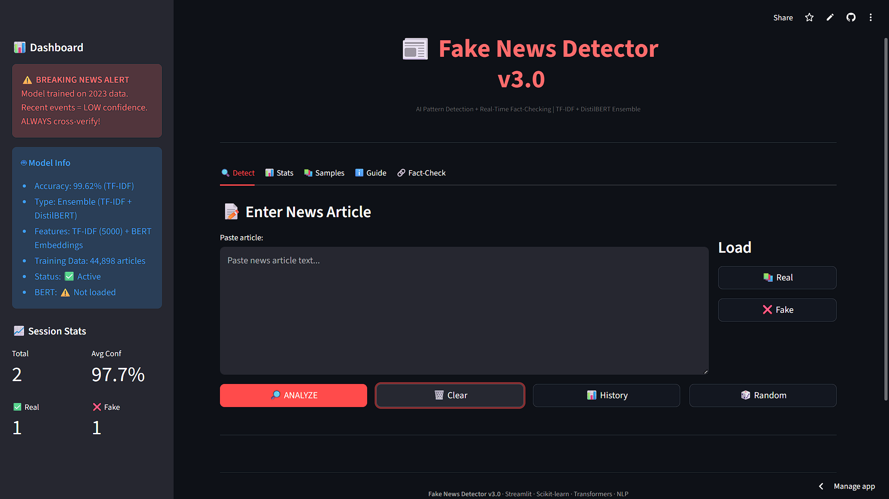
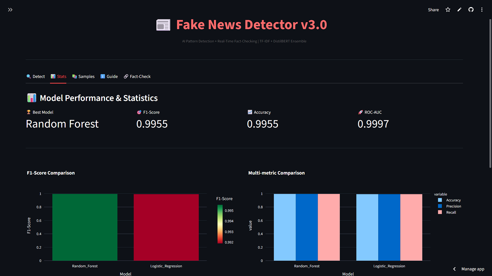

# 🔍 Fake News Detection System

AI‑powered news authentication system that classifies news articles as **Real** or **Fake** using TF‑IDF features and multiple machine learning models (Random Forest, Logistic Regression), exposed through an interactive Streamlit app.
This version was **rebuilt after real-world feedback** to improve preprocessing, modeling and, most importantly, to clearly show the limitations of ML‑only fake news detection.

[](https://ai-fakenews-detector.streamlit.app/)

**🌐 [Live App](https://ai-fakenews-detector.streamlit.app/)** | **💻 [Code](https://github.com/its-Adarsh2003/Fake-News-Detection)** | **📊 [Download Dataset](https://www.kaggle.com/clmentbisaillon/fake-and-real-news-dataset)**





---

## ✨ Key Features

- ✅ Real‑time fake news detection with confidence score  
- ✅ High test accuracy (~99.6%) on the used dataset (Random Forest baseline)  
- ✅ TF‑IDF feature extraction (5000 features, unigrams + bigrams, English stopwords)  
- ✅ Comparison of multiple models: Random Forest and Logistic Regression  
- ✅ Clean Streamlit UI with Detect, Statistics, Samples and Guide tabs  
- ✅ Clear disclaimer + limitations so users understand what the model **can** and **cannot** do  

---

## 📊 Model Performance (example)

| Model               | Accuracy | Precision | Recall | F1‑Score | ROC‑AUC |
|---------------------|---------:|----------:|-------:|---------:|--------:|
| Random_Forest       | 0.9959   | 0.9959    | 0.9959 | 0.9959   | 0.9998  |
| Logistic_Regression | 0.9925   | 0.9927    | 0.9923 | 0.9925   | 0.9998  |


Exact values are stored in `results/model_results.json` and visualized in the **Statistics** tab of the app.

---

## 🧠 How It Works

1. **Input** → User pastes a news headline or full article text into the Detect tab.  
2. **Preprocessing** → Text is cleaned using `src/preprocess.py`:
   - lowercasing  
   - URL and punctuation removal  
   - stopword removal  
   - stemming / basic normalization  
3. **Feature Extraction** → Cleaned text is converted to TF‑IDF vectors:
   - `max_features = 5000`  
   - `ngram_range = (1, 2)` (unigrams + bigrams)  
4. **Model Training** → `train_pipeline.py`:
   - Trains Random Forest and Logistic Regression  
   - Evaluates both on the test set using multiple metrics  
5. **Model Selection** →
   - Best model by weighted F1‑score is saved as `models/best_model.pkl`  
   - All metrics are saved to `results/model_results.json`  
6. **Inference (Streamlit)** →
   - The app loads the best model + TF‑IDF vectorizer  
   - Predicts Real/Fake and shows probability + simple clickbait/statistics heuristics  

---

## 📚 Dataset

- **Total samples:** ~44,898 news articles  
- **Labels:** Real (1) and Fake (0), roughly balanced  
- **Source:** Kaggle Fake News / Fake vs True News dataset (linked in `data/README.md`).  

### 📥 Download Dataset

### 📥 Download & Place Dataset

1. Download from **[Kaggle: Fake and Real News Dataset](https://www.kaggle.com/clmentbisaillon/fake-and-real-news-dataset)**.  
2. Extract and place the CSV files as:

```text
data/News_dataset/
├── True.csv   # real news
└── Fake.csv   # fake news

---

>⚠️ Important: Both CSV files must be in data/News_dataset/ before running train_pipeline.py.

---

## 🛠 Tech Stack
- **Language:** Python 3.10+  
- **ML / NLP:** scikit-learn, TF-IDF, RandomForestClassifier, LogisticRegression, LinearSVC  
- **App:** Streamlit, Plotly  
- **Data:** Pandas, NumPy, NLTK  

---

Planned future work: integrate external fact‑checking APIs and source‑reputation signals on top of the ML model.
📂 Project Structure
fake-news-detection/
├── data/
│   └── News_dataset/
│       ├── True.csv
│       └── Fake.csv
├── models/
│   └── ...           # saved models, vectorizers
├── notebooks/
│   └── ...           # EDA, experiments
├── results/
│   └── model_results.json
├── screenshots/
│   ├── detect_tab.png
│   └── statistics_tab.png
├── src/
│   ├── model.py      # training / inference logic
│   └── preprocess.py # text preprocessing & feature engineering
├── app.py            # Streamlit app
├── train_pipeline.py # training & evaluation pipeline
├── test_model.py     # quick sanity tests for saved model
├── requirements.txt
├── runtime.txt
└── README.md

---

🛠 Tech Stack
Language: Python 3.10+

ML / NLP: scikit‑learn, TF‑IDF, RandomForestClassifier, LogisticRegression

App: Streamlit, Plotly

Data: Pandas, NumPy, NLTK

---


## 💻 Setup & Usage
💡 Tip: Always activate your virtual environment before installing dependencies.

### Clone Repository
```bash
git clone https://github.com/its-Adarsh2003/fake-news-detection.git
cd fake-news-detection

# Create and activate virtual environment (Windows)
python -m venv venv
venv\Scripts\activate

# Install dependencies
pip install -r requirements.txt
> 💡 Tip: Always activate your virtual environment before installing dependencies.

Download the dataset from Kaggle and place the files under data/News_dataset/ as shown above.

1️⃣ Train models
bash
python train_pipeline.py
This will:

Train Random Forest, Logistic Regression.

Select the best model by F1‑score and save it to models/best_model.pkl.

Save all model metrics to results/model_results.json.

(Optional) quick test:
bash
python test_model.py
2️⃣ Run Streamlit app
bash
streamlit run app.py
Use the tabs to:

Detect fake/real news with confidence.

View model comparison charts.

Test with sample articles.

Read the guide on fake news and verification.

---

⚠️ Important Disclaimer
This project is for educational and research purposes only.

Predictions may be incorrect, especially for:

Very recent / breaking news

Highly contextual or sarcastic statements

Adversarially crafted text

Real‑world fact‑checking often requires:

Cross‑checking multiple trusted sources

Official statements, videos, interviews, and metadata

Treat this app as a signal generator, not an ultimate truth detector. Always verify critical news with multiple reliable sources.

 Author
Adarsh Dubey
CSE (AI & ML) undergrad | Building practical ML/NLP apps and data products.

Feedback, issues and suggestions are always welcome.
